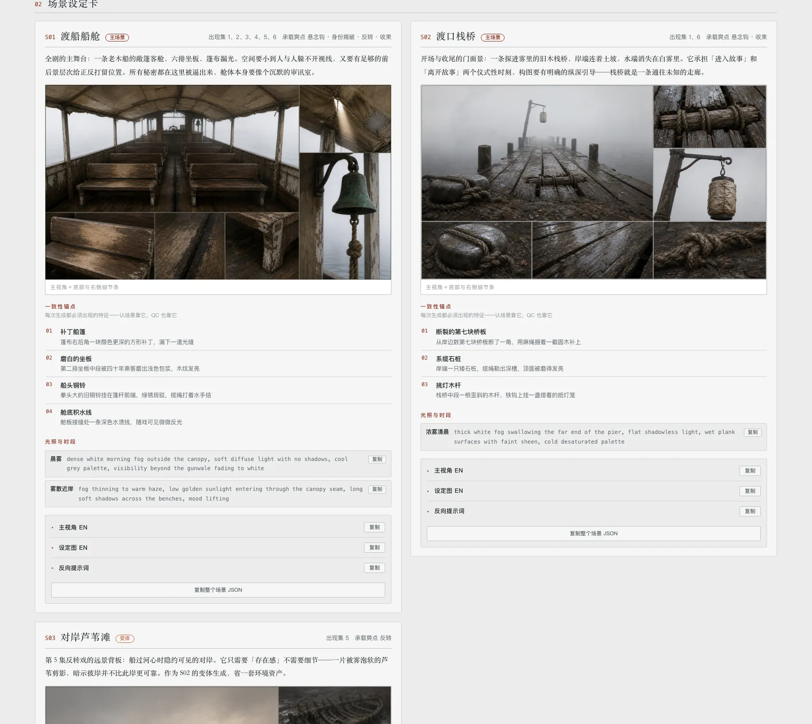
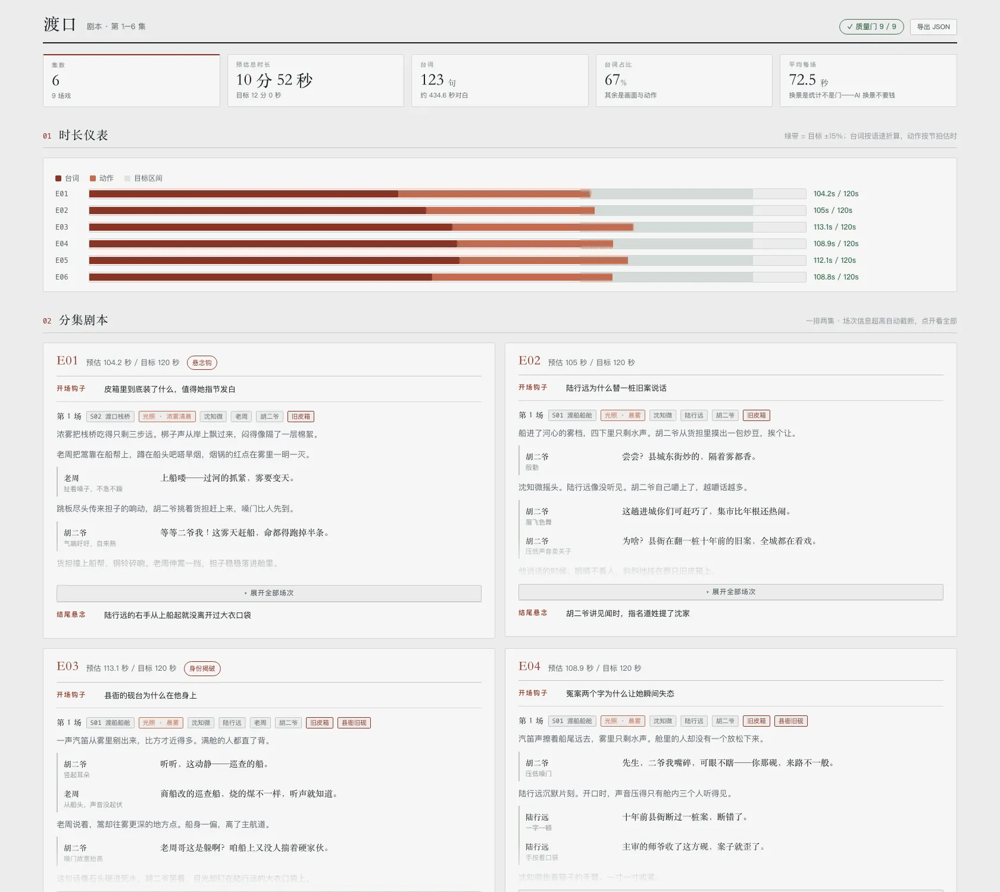

[中文](README.md) · **English**

> These skills are free and open source, built and battle-tested on real AI short-drama production.
> If they save you an afternoon, consider [**buying me a coffee on Ko-fi**](https://ko-fi.com/eternityspring) ☕ — it keeps the updates coming.

# shuohao-skills-2

**Agent skills for AI short-drama production** — from a novel to shoot-ready material: character bibles, adaptation outlines, scene & prop bibles, screenplays, shot-level storyboards, plus a project controller that strings the five layers into a trackable pipeline. Built for AI coding agents, **runs in both Claude Code and codex**.

| Skill | What it does |
| --- | --- |
| [**novel-characters**](skills/novel-characters/README.en.md) | Turns a novel into a character bible: profiles, design prompts, voice prompts, model sheets. Report language and image style are both configurable |
| [**novel-outline**](skills/novel-outline/README.en.md) | Adapts a novel into a five-piece short-drama outline: adaptation notes, cast, beats, per-episode synopses, asset list. All 13 quality gates are script-checked; includes a checkup mode for existing outlines |
| [**novel-art**](skills/novel-art/README.en.md) | Art bibles for AI production (scenes + narrative props): consistency anchors, lighting & state variants, scale references, no-people/no-hands white plates. Seeds from outline.json; all 11 quality gates script-checked |
| [**novel-script**](skills/novel-script/README.en.md) | Screenwriting for AI short drama: scenes + beat flow (action beats alternating with dialogue lines), per-episode duration deterministically estimated from reading speed, a per-character line book that feeds straight into TTS. All 10 quality gates script-checked (incl. hook landing in the first 3 beats) |
| [**novel-storyboard**](skills/novel-storyboard/README.en.md) | Breaks the script into a shot-level production sheet: shot ids, shot types, camera, durations, first-frame prompts, H3 video prompts, generation batches — paste-ready for a Krea2 + MiniMax H3 ComfyUI workflow. All 17 quality gates script-checked |
| [**novel-project**](skills/novel-project/README.en.md) | Project control: one project.json ties the five outputs together. `status` shows progress and per-shot production state (storyboard/first-frame/video/TTS stage machine + stale-artifact propagation), `build` tells you what to run next, `verify` runs cross-layer contract checks plus a cross-shot continuity state machine (wardrobe / prop / lighting jumps) |
| [**h3-prompt-writing**](skills/h3-prompt-writing/README.en.md) | Spec source for MiniMax H3 prompts: the four base modes plus the six-section Ref2VA rewrite. novel-storyboard generates its H3 prompts against it |

Point it at a novel and you get all five:

**novel-characters · character bible**


**novel-outline · short-drama adaptation outline**


**novel-art · art bible (scenes + props, sheets actually generated by the skill)**



**novel-script · screenplay (duration gauge + episode scripts + line book)**



**novel-storyboard · shot-level production sheet (first-frame prompts + H3 video prompts + batches)**

Storyboards are generated deterministically; sample report and the end-to-end ComfyUI
workflow live in the [demo](skills/novel-storyboard/demo/README.md).

## Install

```bash
git clone https://github.com/Aibrother258/shuhao-skills-2.git
cd shuhao-skills-2
./scripts/install.sh
```

It detects whether you have Claude Code or codex installed and **symlinks** every skill into place — so `git pull` takes effect immediately, with no reinstall.

```bash
./scripts/install.sh novel-characters   # just one skill
./scripts/install.sh --codex            # only into codex
./scripts/install.sh --uninstall        # remove the symlinks
```

Prefer to do it by hand:

```bash
ln -s "$PWD/skills/novel-characters" ~/.claude/skills/novel-characters
ln -s "$PWD/skills/novel-characters" ~/.codex/skills/novel-characters
```

## Requirements

| | Required? | Notes |
| --- | --- | --- |
| **Node** | Yes | ≥ 18. The skill scripts use only the standard library — **no npm dependencies, nothing to install** |
| **Model quota** | Yes | Uses your current session's quota. **No API key needed** |
| **codex CLI** | Optional | Only for image generation (via its built-in `$imagegen`). Without it, image steps are skipped and everything else still runs |

> **Note on output language.** These skills are Chinese-first. `novel-characters` produces Chinese character profiles even for an English source novel, and its validator actively rejects English in those fields. See that skill's README for what it would take to change.

## Repository conventions

One directory per skill, **self-contained and copyable on its own**:

```
skills/<skill-name>/
├── SKILL.md          the workflow the agent reads (required)
├── README.md         the docs a human reads
├── scripts/
│   ├── <name>.mjs    deterministic helpers, zero dependencies
│   └── selftest.mjs  self-test, never calls a model (required)
├── references/       detailed instructions, loaded on demand
├── examples/         bundled samples that double as test fixtures
└── assets/           screenshots
```

Three hard requirements:

- Every skill must have a `SKILL.md`
- Every skill must have a `scripts/selftest.mjs` that **calls no model and costs no quota**, covering all deterministic logic
- Every skill must have `README.md` / `README.en.md`, and frontmatter with `name` / `version` / `description` / `triggers`

Run the repo-level check plus every self-test before adding a skill:

```bash
node scripts/check.mjs --run
```

`check.mjs` enforces the structural requirements (SKILL.md / self-test / bilingual README /
frontmatter); `--run` also executes every self-test. Self-tests only:

```bash
for f in skills/*/scripts/selftest.mjs; do node "$f"; done
```

CI is configured: `.github/workflows/ci.yml` runs `check.mjs --run` plus the novel-project checks on **Node 18 / 20 / 22** on every push. Self-tests are also fast enough to run locally:

```bash
node scripts/check.mjs --run        # structure check + every skill's self-test
```

There is no platform-specific code, so it runs on macOS and Linux alike; verified on Node 18/20/22.


## License

[Apache 2.0](LICENSE)
